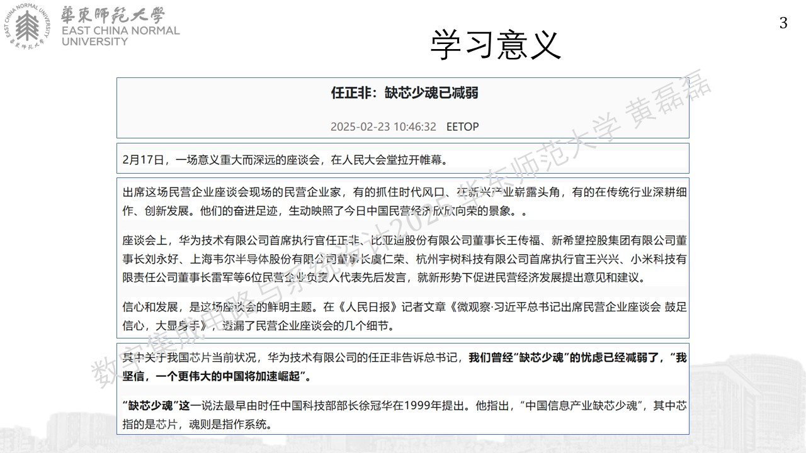
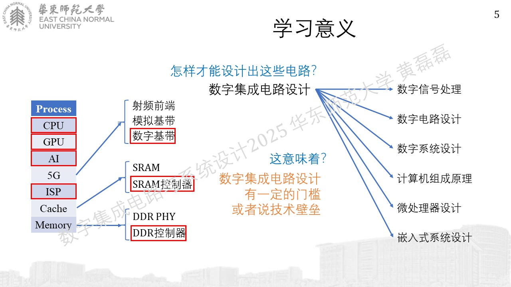
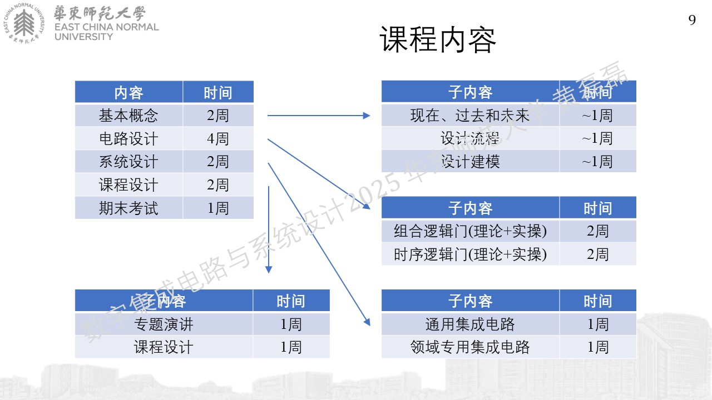
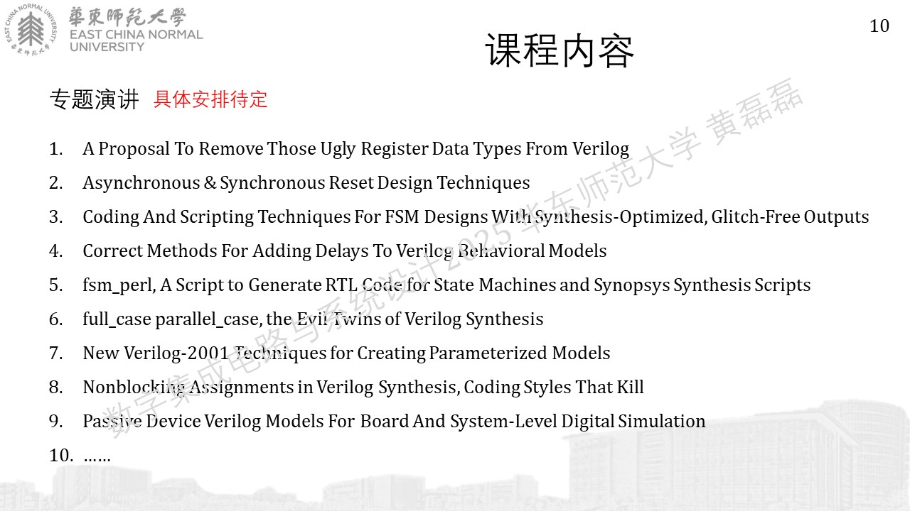
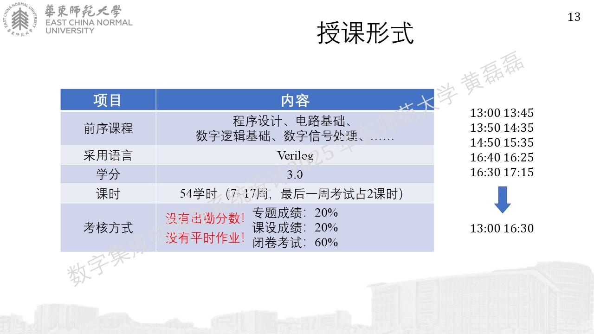
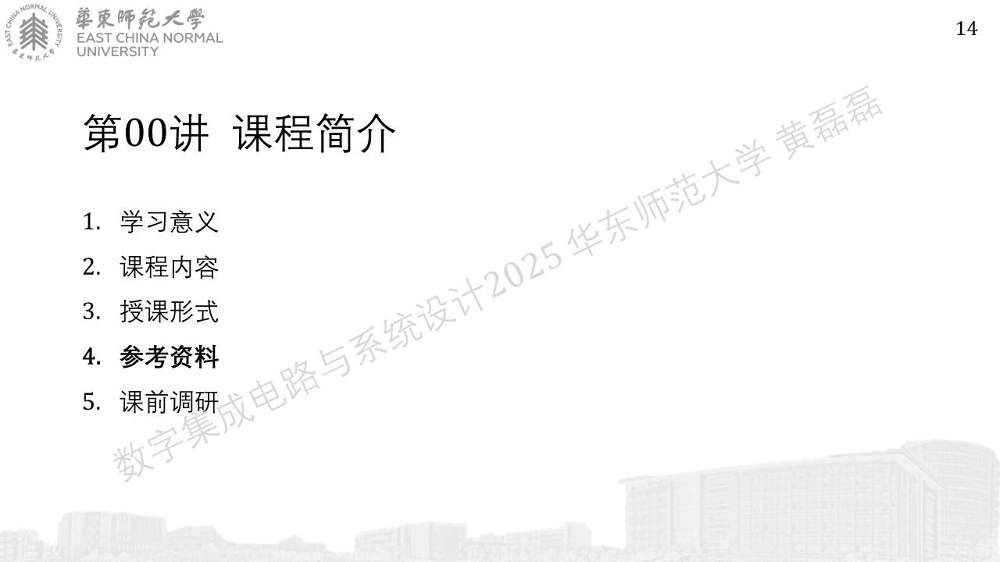
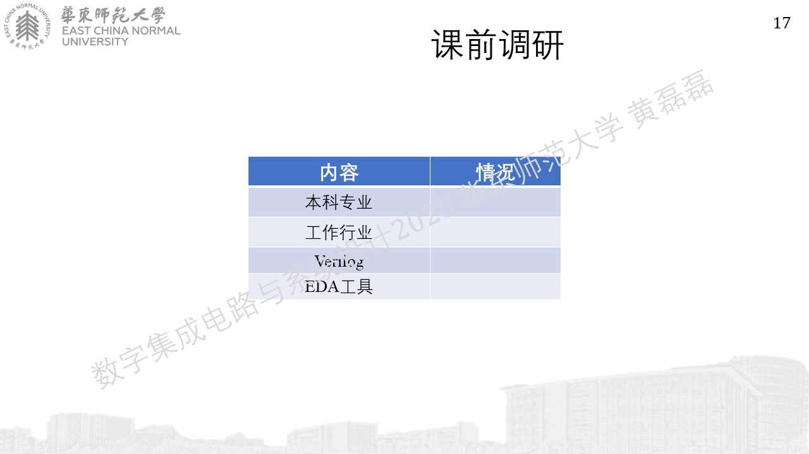

.. -----------------------------------------------------------------------------
   ..
   ..  Filename       : index.rst
   ..  Author         : Huang Leilei
   ..  Status         : phase 000
   ..  Created        : 2025-04-05
   ..  Description    : description about 第00讲 - 课程简介
   ..
.. -----------------------------------------------------------------------------

第00讲 - 课程简介
--------------------------------------------------------------------------------

学习意义
........................................

https://www.hisilicon.com/cn/products/Kirin/Kirin-flagship-chips/Kirin-9000

https://report.iresearch.cn/report_pdf.aspx?id=4055

课程内容
........................................

授课形式
........................................

参考资料
........................................

https://digital-integrated-circuit-and-system-design.readthedocs.io/en/latest/

课前调研
........................................
.. image:: 幻灯片16.JPG

