.. -----------------------------------------------------------------------------
   ..
   ..  Filename       : index.rst
   ..  Author         : Huang Leilei
   ..  Status         : phase 000
   ..  Created        : 2025-09-21
   ..  Description    : description about 补充C.2 - Booth乘法器
   ..
.. -----------------------------------------------------------------------------

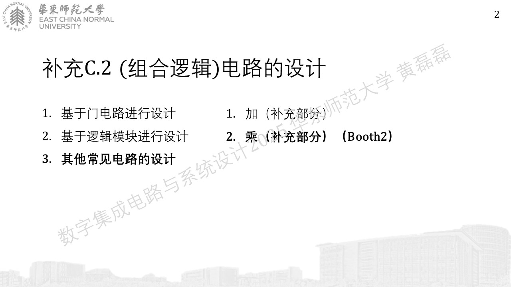

*全部是正数*
........................................

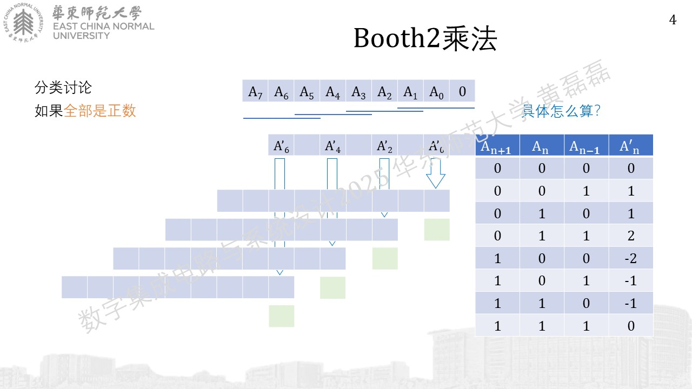

*全部是负数*
........................................

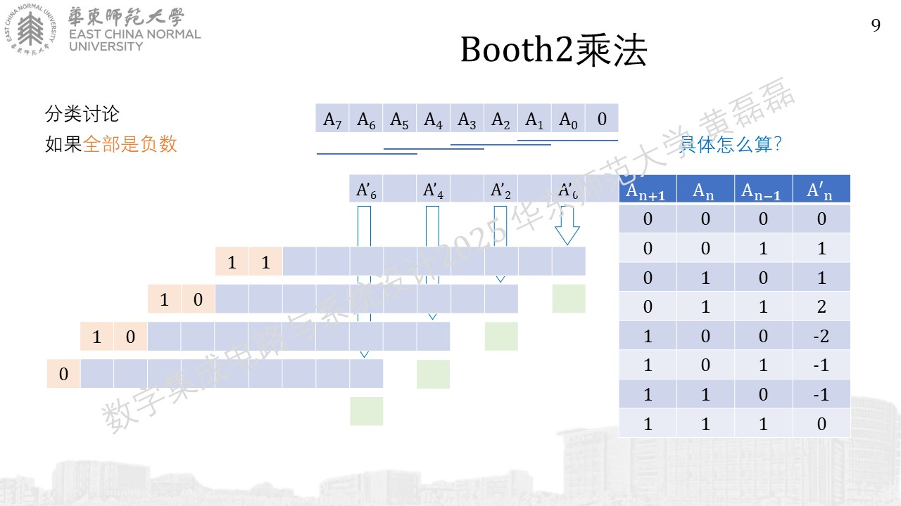

*部分正，部分负（1）*
........................................

*部分正，部分负（2）*
........................................

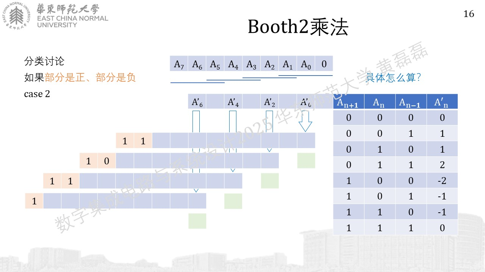

*部分正，部分负（3）*
........................................

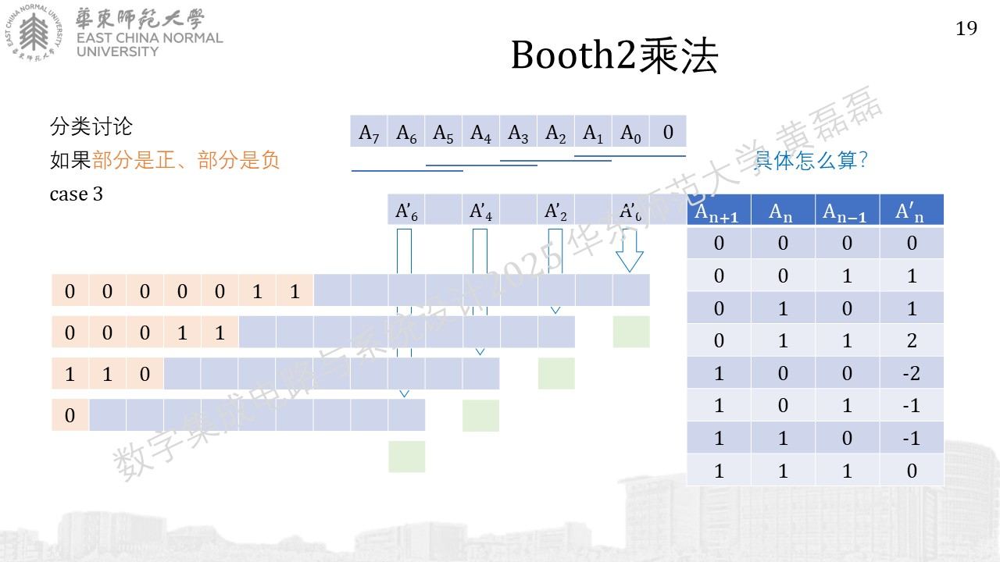
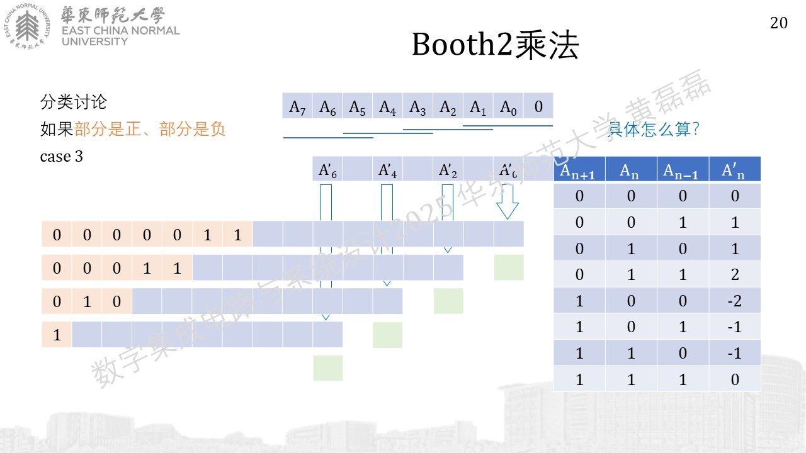

*部分正，部分负（4）*
........................................

*部分正，部分负（5）*
........................................

*总结*
........................................
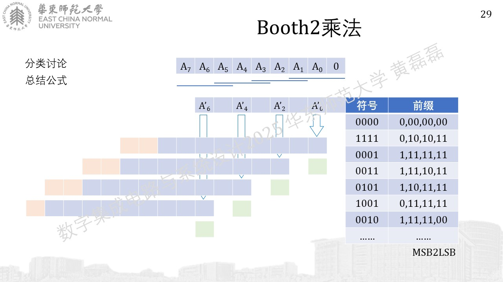
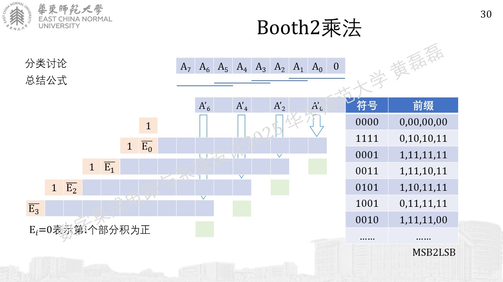
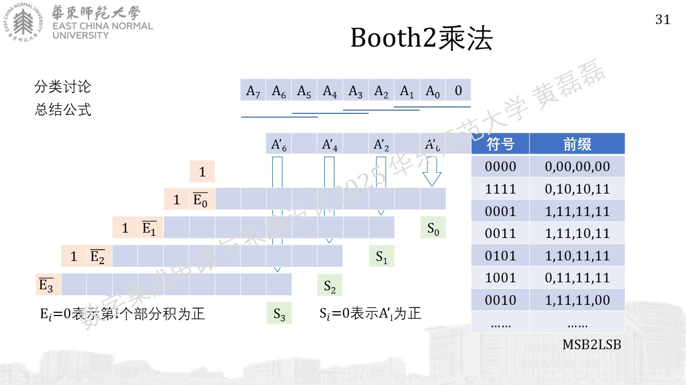
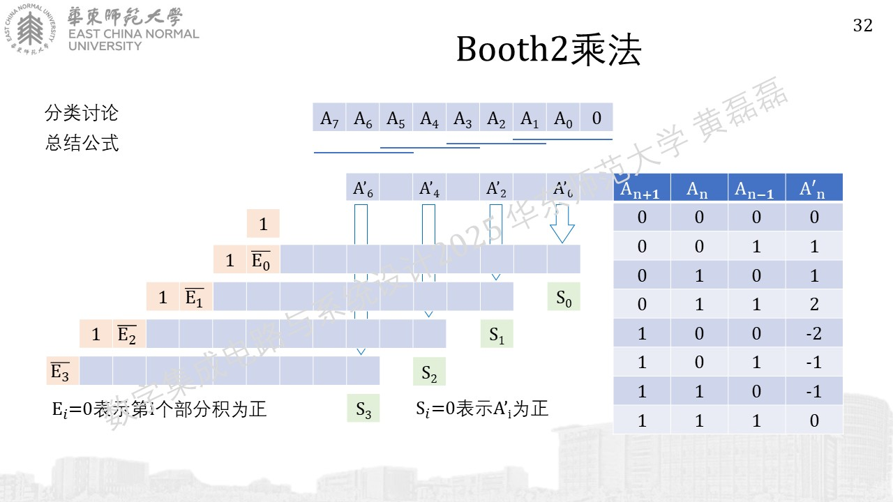
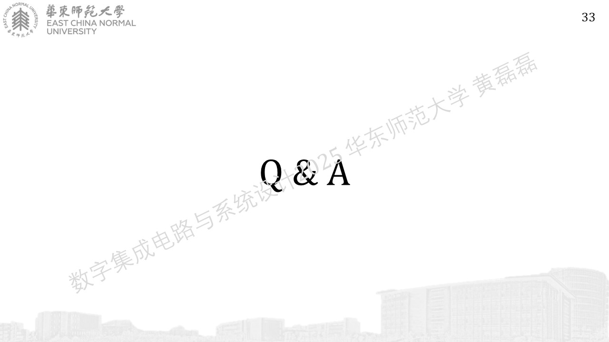
