.. -----------------------------------------------------------------------------
   ..
   ..  Filename       : index.rst
   ..  Author         : Huang Leilei
   ..  Status         : phase 000
   ..  Created        : 2023-11-11
   ..  Description    : description about 第09讲 - 领域专用集成电路设计(视频编码) - 图像与视频的基本概念
   ..
.. -----------------------------------------------------------------------------

第09讲 - 领域专用集成电路设计(视频编码) - 图像与视频的基本概念
--------------------------------------------------------------------------------

图像的定义和分类
........................................
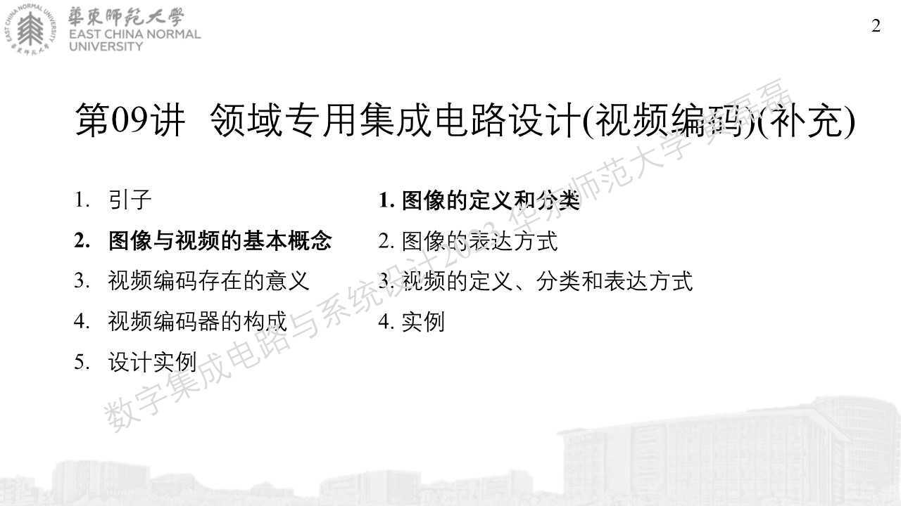
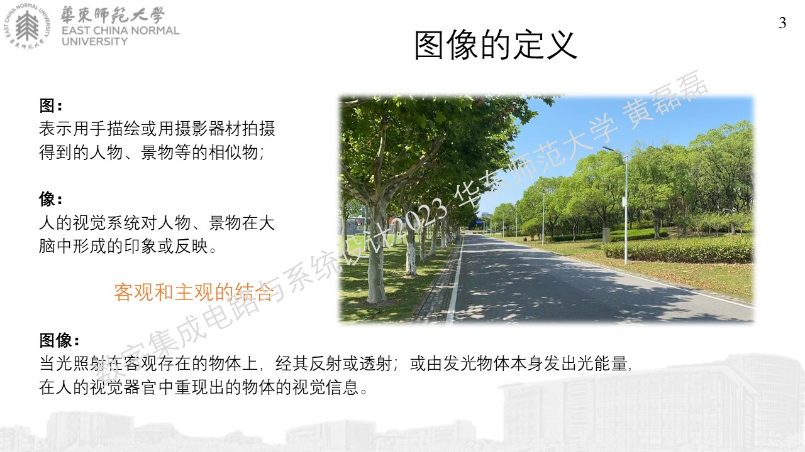
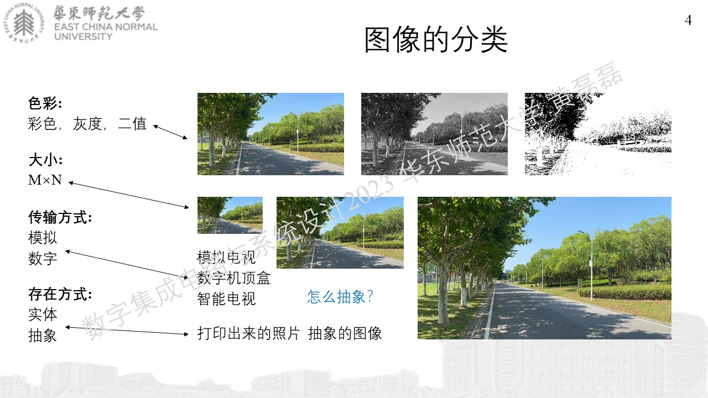

图像的表达方式
........................................
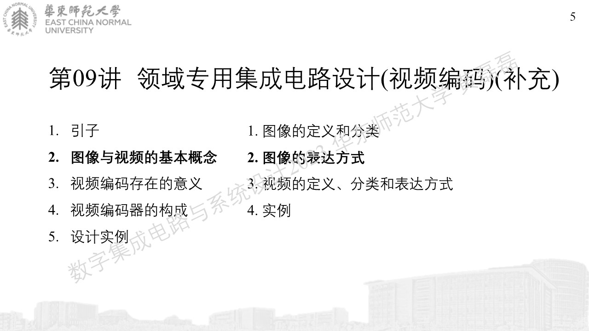
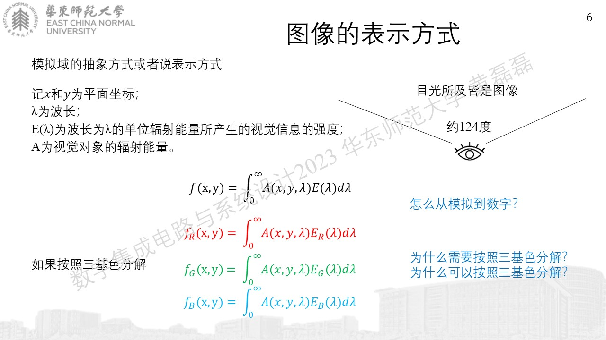
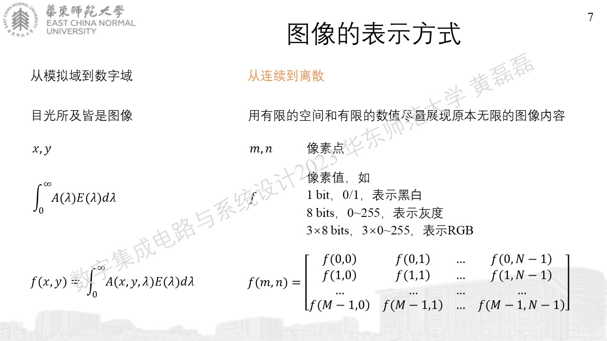
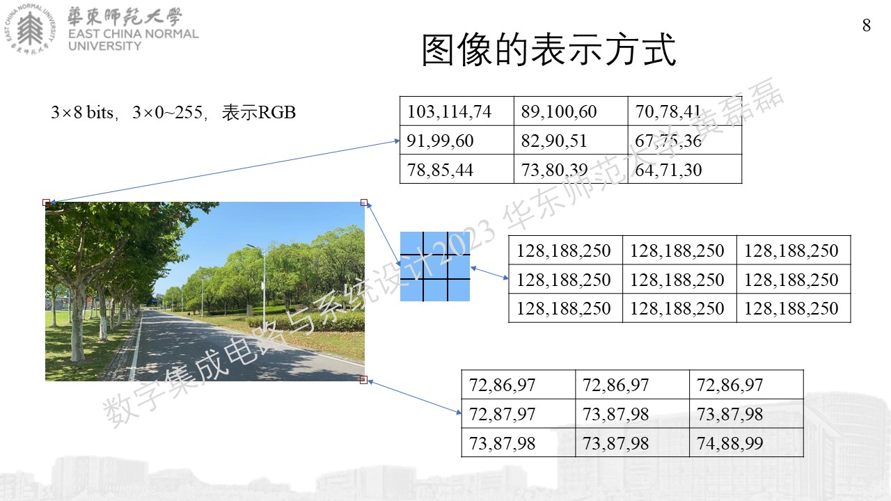

视频的定义、分类和表达方式
........................................
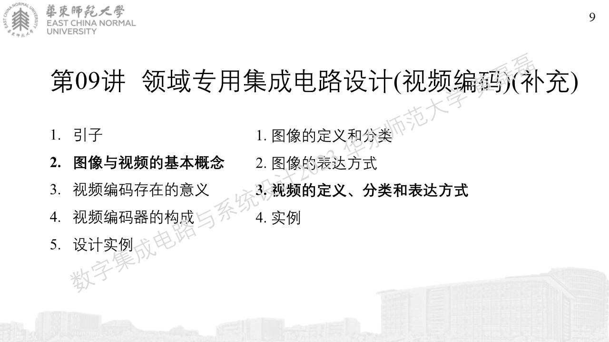
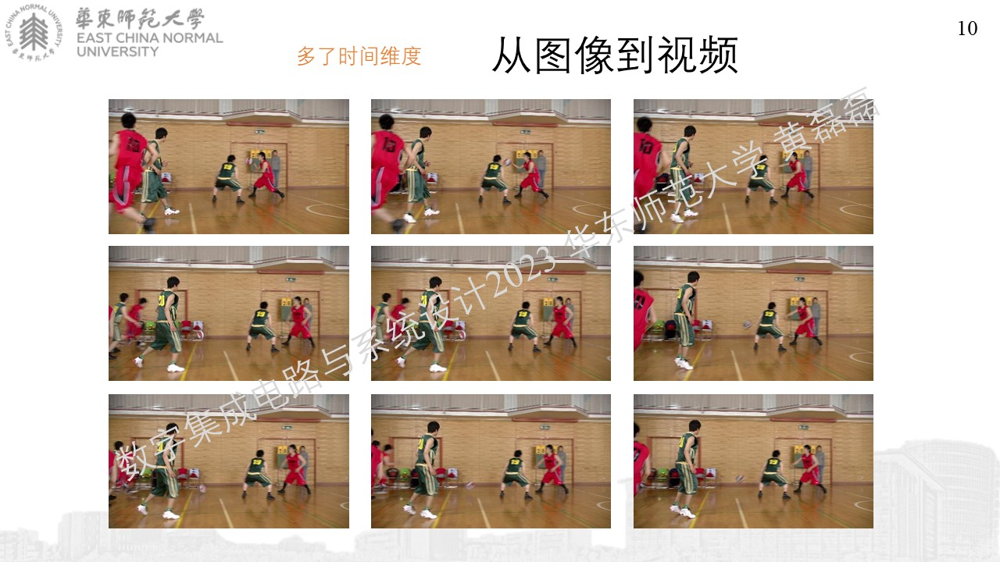
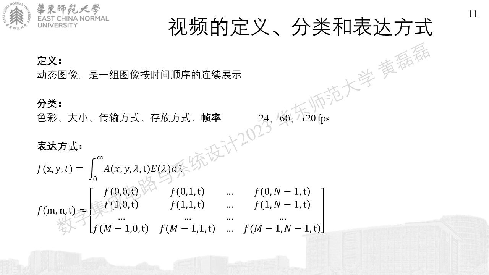

实例
........................................
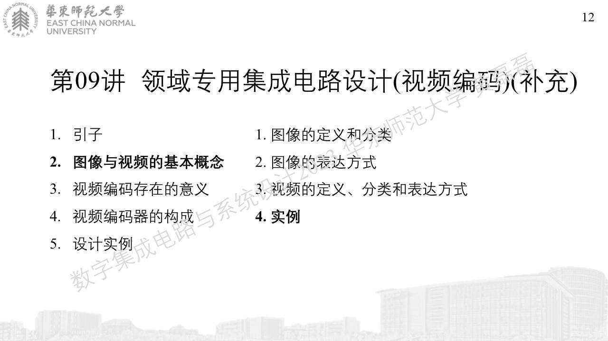
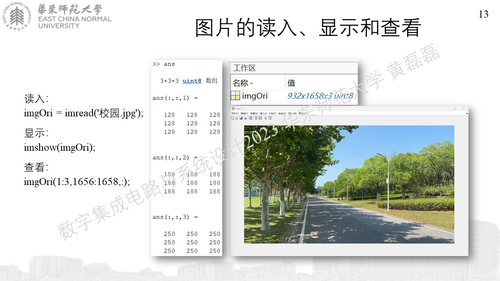
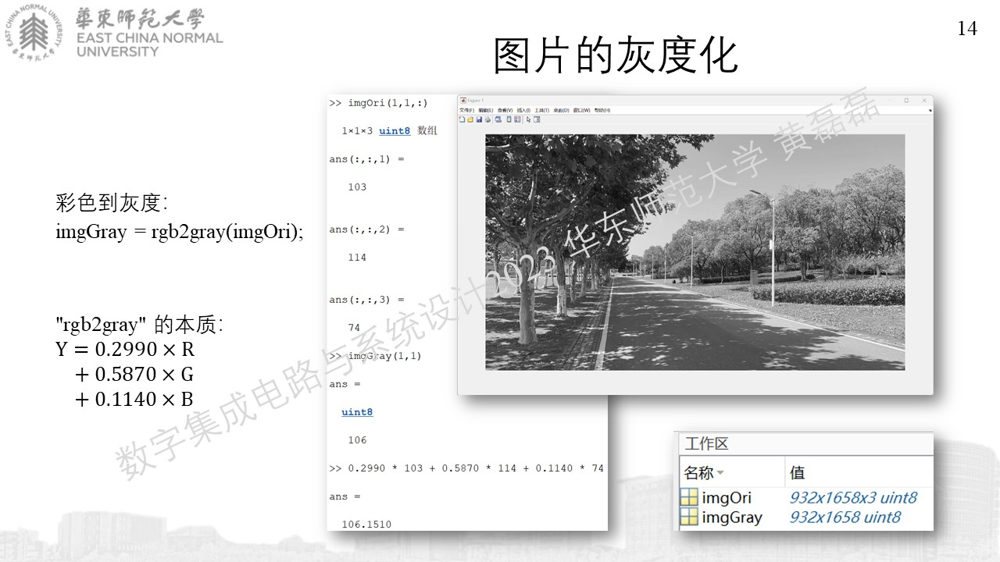
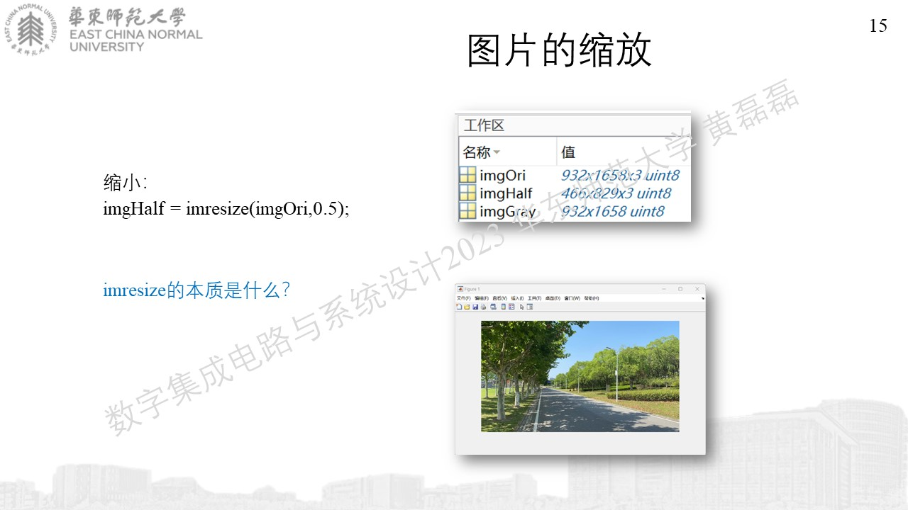
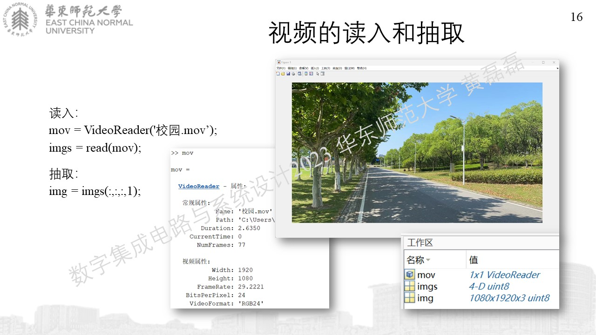
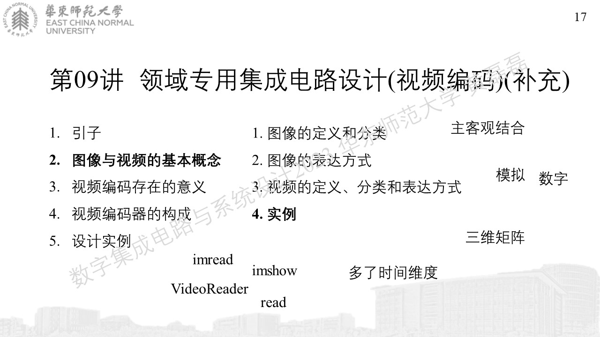
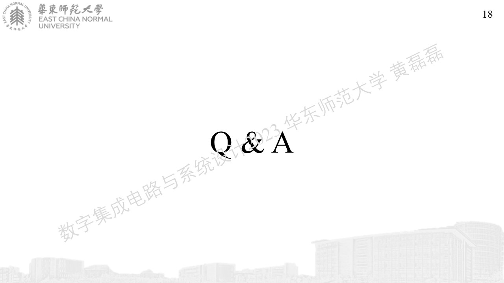
