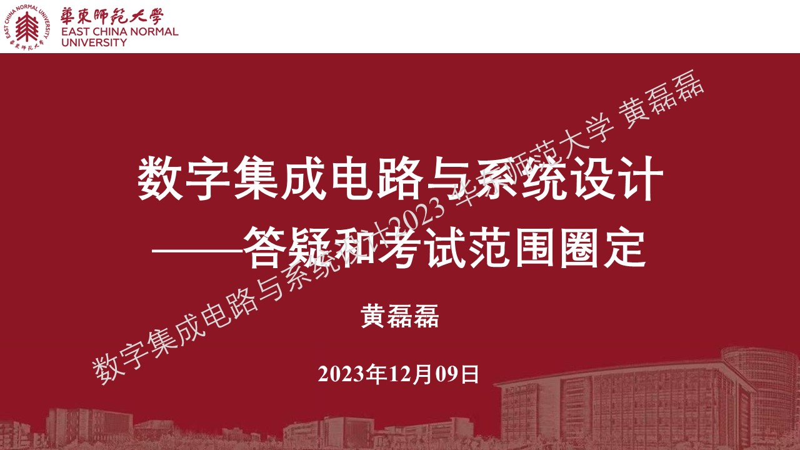

.. -----------------------------------------------------------------------------
   ..
   ..  Filename       : index.rst
   ..  Author         : Huang Leilei
   ..  Status         : phase 000
   ..  Created        : 2023-12-09
   ..  Description    : description about 第13讲 - 答疑和考试范围圈定
   ..
.. -----------------------------------------------------------------------------

第13讲 - 答疑和考试范围圈定
--------------------------------------------------------------------------------

翻译10题，每题1分
........................................
.. image:: ../数字集成电路与系统设计\ -\ 第01讲\ -\ 基本概念\ -\ 1\ -\ 现在/幻灯片17.JPG
.. image:: ../数字集成电路与系统设计\ -\ 第01讲\ -\ 基本概念\ -\ 1\ -\ 现在/幻灯片23.JPG
.. image:: ../数字集成电路与系统设计\ -\ 第01讲\ -\ 基本概念\ -\ 1\ -\ 现在/幻灯片28.JPG
.. image:: ../数字集成电路与系统设计\ -\ 第01讲\ -\ 基本概念\ -\ 1\ -\ 现在/幻灯片40.JPG
.. image:: ../数字集成电路与系统设计\ -\ 第01讲\ -\ 基本概念\ -\ 1\ -\ 现在/幻灯片49.JPG

选择5题，每题2分
........................................
.. image:: ../数字集成电路与系统设计\ -\ 第03讲\ -\ 设计建模\ -\ 1\ -\ 语法要素/幻灯片11.JPG
.. image:: ../数字集成电路与系统设计\ -\ 第03讲\ -\ 设计建模\ -\ 1\ -\ 语法要素/幻灯片21.JPG
.. image:: ../数字集成电路与系统设计\ -\ 第03讲\ -\ 设计建模\ -\ 1\ -\ 语法要素/幻灯片25.JPG
.. image:: ../数字集成电路与系统设计\ -\ 第03讲\ -\ 设计建模\ -\ 2\ -\ 建模方法/幻灯片25.JPG
.. image:: ../数字集成电路与系统设计\ -\ 第03讲\ -\ 设计建模\ -\ 3\ -\ 可综合建模/幻灯片6.JPG

填空1题，本题10分
........................................
.. image:: ../数字集成电路与系统设计\ -\ 第02讲\ -\ 设计流程\ -\ 1\ -\ 设计描述/幻灯片49.JPG

分析1题，本题10分
........................................
.. image:: ../数字集成电路与系统设计\ -\ 第05讲\ -\ 进入时序逻辑之前的回顾\ -\ 2\ -\ 触发器的电路层/幻灯片37.JPG
.. image:: ../数字集成电路与系统设计\ -\ 第05讲\ -\ 进入时序逻辑之前的回顾\ -\ 2\ -\ 触发器的电路层/幻灯片38.JPG
.. image:: ../数字集成电路与系统设计\ -\ 第05讲\ -\ 进入时序逻辑之前的回顾\ -\ 2\ -\ 触发器的电路层/幻灯片39.JPG
.. image:: ../数字集成电路与系统设计\ -\ 第05讲\ -\ 进入时序逻辑之前的回顾\ -\ 2\ -\ 触发器的电路层/幻灯片40.JPG

设计1题，本题10分
........................................
verilog

简答3题，每题10分
........................................
.. image:: ../数字集成电路与系统设计\ -\ 第02讲\ -\ 设计流程\ -\ 2\ -\ 设计方法/幻灯片4.JPG
.. image:: ../数字集成电路与系统设计\ -\ 第02讲\ -\ 设计流程\ -\ 2\ -\ 设计方法/幻灯片5.JPG
.. image:: ../数字集成电路与系统设计\ -\ 第06讲\ -\ 进入时序逻辑之前的讨论\ -\ 2\ -\ 复位/幻灯片5.JPG
.. image:: ../数字集成电路与系统设计\ -\ 第06讲\ -\ 进入时序逻辑之前的讨论\ -\ 2\ -\ 复位/幻灯片6.JPG
.. image:: ../数字集成电路与系统设计\ -\ 第06讲\ -\ 进入时序逻辑之前的讨论\ -\ 2\ -\ 复位/幻灯片7.JPG
.. image:: ../数字集成电路与系统设计\ -\ 第07讲\ -\ 时序逻辑\ -\ 2\ -\ 流水线/幻灯片7.JPG
.. image:: ../数字集成电路与系统设计\ -\ 第07讲\ -\ 时序逻辑\ -\ 2\ -\ 流水线/幻灯片22.JPG
.. image:: ../数字集成电路与系统设计\ -\ 第07讲\ -\ 时序逻辑\ -\ 2\ -\ 流水线/幻灯片26.JPG
.. image:: ../数字集成电路与系统设计\ -\ 第07讲\ -\ 时序逻辑\ -\ 2\ -\ 流水线/幻灯片30.JPG

开放回答2题，每题10分
........................................
不作要求
